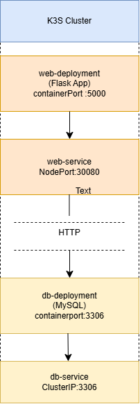
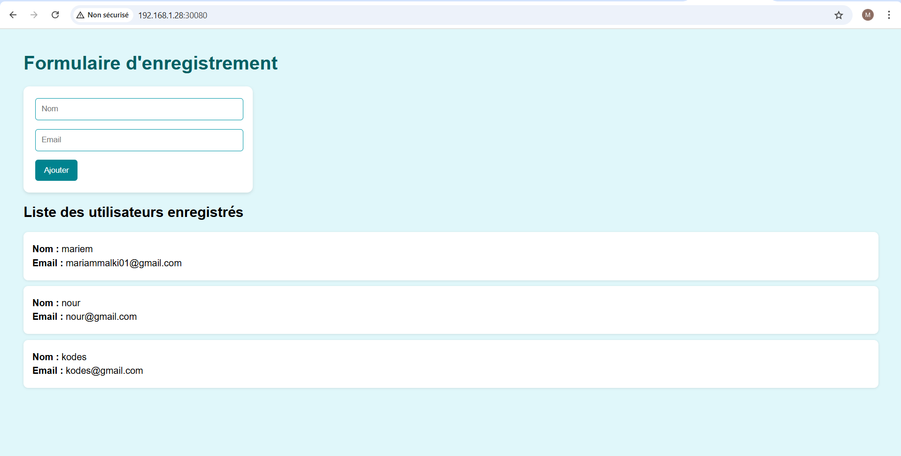
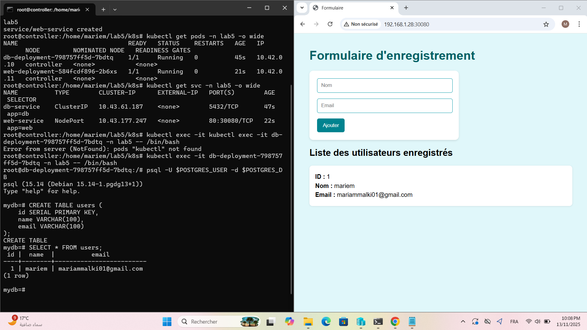

# Lab 5 - Web Application with MySQL on K3s

## 1. Project Overview
This lab demonstrates deploying a two-tier web application on a K3s cluster:
- **Frontend:** Flask web application with a simple form to insert and display user data.
- **Backend:** PostgreSQL, database, internal to the cluster (ClusterIP).
- **No Persistent Volumes or ConfigMaps** are used in this lab.

## 2. Architecture

**Components:**
- **web-deployment:** Flask application
- **web-service:** NodePort service for external access
- **db-deployment:** MySQL database
- **db-service:** ClusterIP service for internal access

---

## 3. Project Structure

lab5-Flask-app/
├── app/                  # Code source et Dockerfile
│   ├── app.py
│   ├── Dockerfile
│   ├── requirements.txt
│   └── templates/
│       └── index.html
├── k8s/                  # Manifests Kubernetes
│   ├── namespace.yaml   
│   ├── db-deployment.yaml
│   ├── db-service.yaml
│   ├── web-deployment.yaml
│   └── web-service.yaml
├── scripts/              # Scripts pour build et déploiement
│   └── install.sh
├── docs/                 # Documentation et captures d’écran
│   ├── architecture.png
│   └── screenshots/
└── README.md

---

## 4. Deployment Steps

1. Build and push Docker image:

./scripts/install.sh

2. Verify pods and services:
kubectl get pods
kubectl get svc

3. Access the web application via browser:
http://<NODE_IP>:<NODE_PORT>/
Soumettre un formulaire avec nom et email.

---

## 5. Testing / Validation

Fill in the form with name and email.

Submit and verify that the data appears in the list below.

Take screenshots for documentation:

Form submission: 

Je me connecte au pod db-deployment pour tester que les données saisies dans le formulaire,  le nom et l’e-mail, apparaissent correctement dans la base de données:

---
## 6. Notes

All sensitive parameters are set directly in Deployment YAML files.

No Persistent Volumes (PV) are used; data will be lost if the DB pod is deleted.

No ConfigMaps or Secrets are used.
